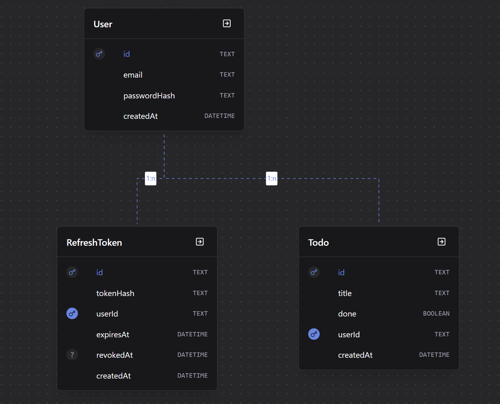

# List to Do

A to-do list with JWT authentication where **each user only ever sees their own tasks**. Node and
Fastify on the API, React Native and Expo on the app.

A learning project built to implement authentication and authorization by hand — no
authentication-as-a-service — in order to understand every decision behind them.

```
list-to-do/
├── server/   API: Node + Fastify + Prisma + SQLite
├── mobile/   App: Expo + Expo Router
└── docs/     documentation
```

## What's in it

**Authentication**

- Registration and login with **argon2** password hashing
- **Access token** (JWT, HS256) valid for 15 minutes, verified without a database round trip
- **Refresh token** valid for 30 days, stored in the database as a SHA-256 hash only
- **Rotation**: every refresh token is valid exactly once
- **Reuse detection**: a token used twice revokes every session of that user
- Logout that revokes the session server-side
- Identical response **and identical timing** for "no such email" and "wrong password"

**Authorization**

- The `userId` always comes from the token, never from the request body
- Updates and deletes filter by `id` **and** `userId` in the same query
- **404 instead of 403** on another user's data, so the API never confirms a record exists

**App**

- Refresh token in **expo-secure-store** (Keychain on iOS, Keystore on Android)
- Automatic access token renewal, with only **one refresh in flight at a time**
- Routes protected by `Stack.Protected`: without a session, the screen does not exist
- Session restored on app start

## Data model



`Todo.userId` is what makes each task belong to one person, and `RefreshToken` keeps one row per
active session — with `revokedAt` as the switch that makes a session revocable. Field by field in
[docs/database.md](docs/database.md).

## Stack

| | |
|---|---|
| API | Node, [Fastify](https://fastify.dev), [Prisma](https://prisma.io) + SQLite, TypeScript |
| Security | [argon2](https://github.com/ranisalt/node-argon2) for passwords, [jose](https://github.com/panva/jose) for JWTs, [zod](https://zod.dev) for validation |
| App | [Expo](https://expo.dev), Expo Router, React Native, expo-secure-store |

## Running it

Requires Node 22+, the Expo Go app on your phone, and both devices on the same Wi-Fi network.

```bash
# API
cd server
npm install
cp .env.example .env
node -e "console.log(require('crypto').randomBytes(48).toString('base64url'))"   # paste into JWT_SECRET
npx prisma migrate dev        # create the database
npm run dev                   # http://localhost:3333

# App (in another terminal)
cd mobile
npm install
cp .env.example .env          # set EXPO_PUBLIC_API_URL to your computer's IP (ipconfig)
npx expo start                # scan the QR code with Expo Go
```

Full walkthrough, everyday commands and troubleshooting in
[docs/development.md](docs/development.md).

## Documentation

| document | topic |
|---|---|
| [architecture.md](docs/architecture.md) | how the parts fit together and why each decision was made |
| [authentication.md](docs/authentication.md) | the full JWT flow, from login to token rotation |
| [authorization.md](docs/authorization.md) | how each user only ever sees their own data |
| [api.md](docs/api.md) | route reference, with bodies and status codes |
| [database.md](docs/database.md) | models, migrations and Prisma commands |
| [mobile-app.md](docs/mobile-app.md) | routes, auth context and HTTP client |
| [development.md](docs/development.md) | setup, manual tests and troubleshooting |

## API at a glance

| route | token | what it does |
|---|---|---|
| `POST /auth/register` | — | creates the account and returns a session |
| `POST /auth/login` | — | authenticates and returns the token pair |
| `POST /auth/refresh` | — | trades the refresh token for a new pair |
| `POST /auth/logout` | — | revokes the session |
| `GET /todos` | yes | lists the user's tasks |
| `POST /todos` | yes | creates a task |
| `PATCH /todos/:id` | yes | toggles it done |
| `DELETE /todos/:id` | yes | deletes it |

Details in [docs/api.md](docs/api.md).

## Testing the authorization

The test that gives the project its point: create users A and B, then use B's token to read,
update and delete one of A's tasks. Every attempt must answer **404**. Ready-to-run commands are
in [docs/development.md](docs/development.md#authorization-test).

## What this project does not have

Being a learning project, it leaves out login rate limiting, email confirmation, password
recovery, local HTTPS, cleanup of expired tokens, and automated tests. The reasoning behind each
omission is in [docs/architecture.md](docs/architecture.md#known-limits).
